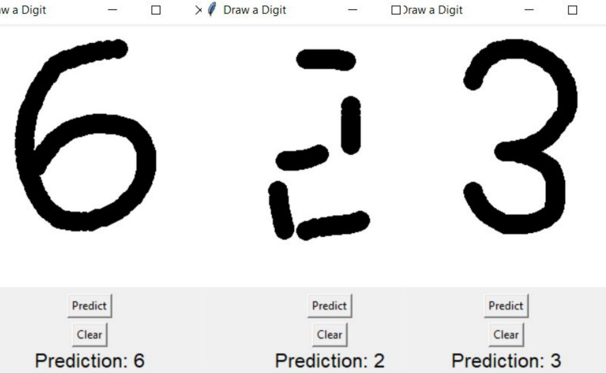
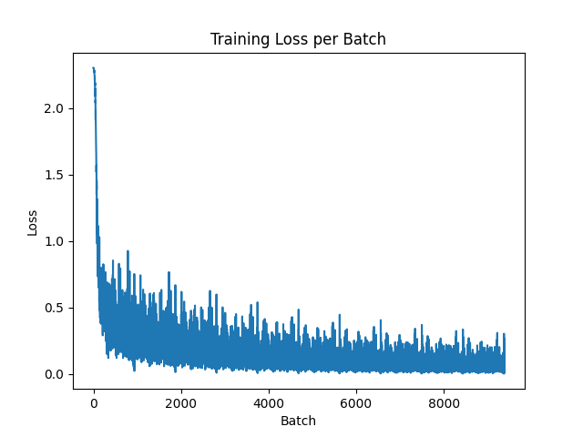

# DeepScratch

This project allows you to draw any digit from 0 to 9, and it will predict the number you wrote. What's special about this project is that it implements a full neural network from scratch using only NumPy — no machine learning frameworks like TensorFlow or PyTorch were used. It's a great way to understand how neural networks actually work under the hood.

---

## Story Behind

When you draw a digit and click "Predict", the app instantly shows you its prediction, just like the example below:
<br>


But have you ever wondered what happens internally during the training and prediction steps? Let's walk through the full journey step by step.

---

## 1: Drawing and Image Preparation

When you draw a digit on a white canvas (280x280 pixels), the app performs several steps to prepare your input for the neural network:

1. It resizes the image to 28x28 pixels.
2. The colors are inverted — the digit becomes white and the background becomes black.
3. Pixel values are normalized to the range [0, 1].
4. The 2D image is flattened into a 1D vector so it can be processed by the network.

---

## 2: The Neural Network Structure

| Layer       | Size  | Activation |
|-------------|-------|------------|
| Input       | 784   | –          |
| Hidden      | 128   | ReLU       |
| Output      | 10    | Softmax    |

Everything — from the weights to the activations — is implemented manually using NumPy arrays.

---

## 3: Training the Model

Before your app could start recognizing digits correctly, the neural network needed to go through a learning process known as training. During training, the model studies thousands of labeled handwritten digit images (from the MNIST dataset) and learns how to map the patterns in these images to their correct labels (0–9).

Here’s a step-by-step breakdown of what happens in the training phase:

---

### Step 1: Forward Propagation

The first step is making a guess. Each image is first converted into a long list of numbers — specifically, a flattened vector of 784 pixel values (since 28x28 = 784). This vector is passed into the neural network.

The input flows into the hidden layer, where each pixel value is combined with weights and biases to produce a new set of values. These represent a learned transformation of the input.

An activation function (in this case, ReLU) is applied, which introduces non-linearity. This helps the network detect complex patterns in the data.

The result is then passed into the output layer, which computes a final set of values — one for each possible digit (0–9).

These values are converted into probabilities using a Softmax function, meaning the network “guesses” which digit is most likely the correct one based on what it learned so far.

At this point, the network has made a prediction — but we still don’t know how accurate it is.

---

### Step 2: Loss Calculation

Once the prediction is made, we compare it to the true label (the correct digit the image represents). The goal is to measure how wrong the prediction was.

To do this, we use a loss function — a formula that compares the predicted values with the actual values. The loss function used here is cross-entropy loss, which gives a higher value when the prediction is far from the correct answer, and a lower value when it's close.

This loss score becomes the guiding signal for learning: the higher the loss, the bigger the mistake — and the more the network needs to adjust.

---

### Step 3: Backpropagation — Learning from Mistakes

After calculating how wrong the prediction was, the network needs to adjust its internal settings (weights and biases) to improve.

1. **Output Error**: We compute how far the predicted output was from the correct answer.

2. **Gradients for Output Layer**: Using that error, we compute how to change the final weights and biases to reduce the mistake.

3. **Send Error Backwards**: The error is then sent backward to the hidden layer. We compute how much each hidden neuron contributed to the final mistake.

4. **ReLU Derivative**: Since we use ReLU in the hidden layer, we apply its derivative: if the input was positive, it passes the gradient; otherwise, it's blocked (zero).

5. **Hidden Layer Gradients**: Based on this backward signal, we calculate how the input weights and biases in the hidden layer should change.

6. **Gradient Descent**: Finally, we adjust all the weights and biases using gradient descent, which gently nudges the parameters in the direction that reduces the loss.

This entire process is repeated for every training image — many times — so the network keeps learning and gets better at recognizing digits.

---

### Step 4: Repeat for Many Epochs

The above steps (forward pass, loss calculation, backpropagation, and gradient descent) are done for every image in the training dataset.
And not just once. The model goes through the entire dataset multiple times, in what's called epochs. Each epoch gives the model another chance to improve its understanding and reduce the overall loss.

With each pass, the model makes fewer mistakes, and the loss gets smaller and smaller — indicating that it’s becoming more accurate in recognizing handwritten digits.

By the end of training, the model has adjusted its internal parameters thousands of times, fine-tuning itself to become a very capable digit recognizer — and it can now confidently predict digits that it has never seen before.

---

## Training Result

The training loss started high and decreased over time to a very small value. This shows the model successfully learned how to recognize digits.
<br>


---

## How to Use It

1. To train the model:
   ```bash
   python main.py

2. Using the GUI(After Building the model):
   ```bash
   python gui.py
